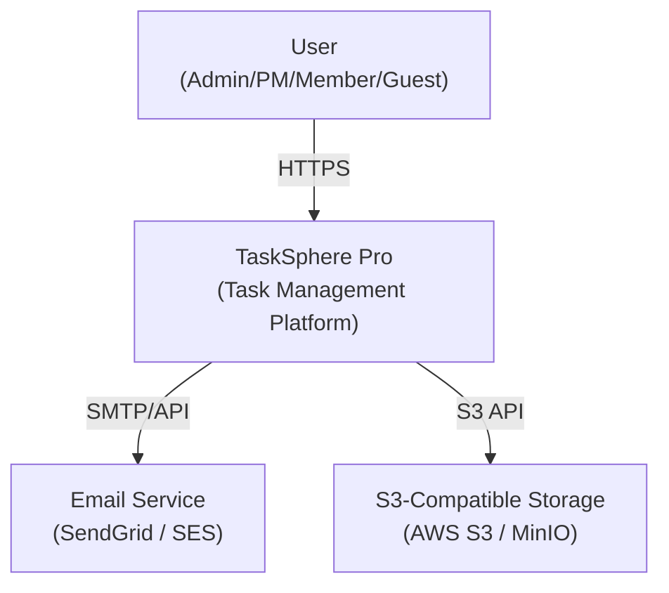
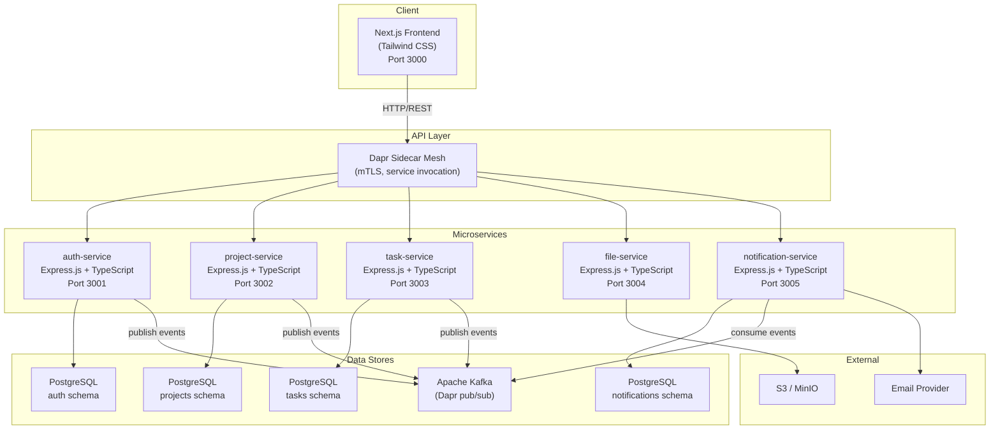
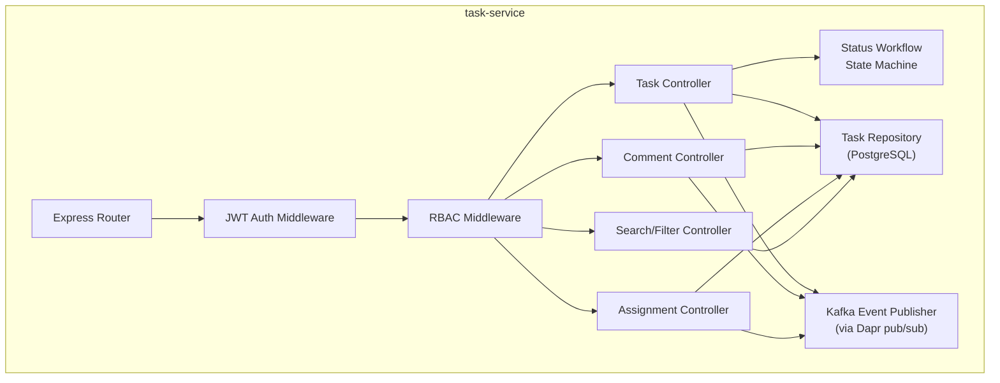
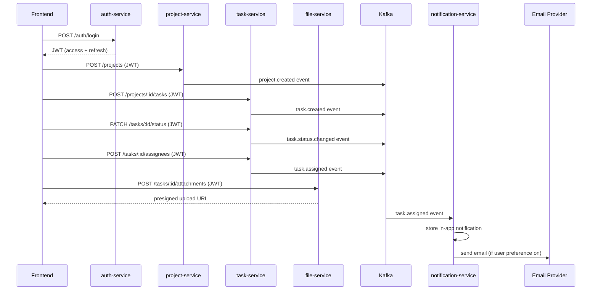

# TaskSphere Pro — C4 Architecture Diagrams

> Produced by Software Architect for ISSUE-0010

## C4 Level 1: System Context

## C4 Level 2: Container Diagram

## C4 Level 3: Component — task-service

## Service Communication Map

