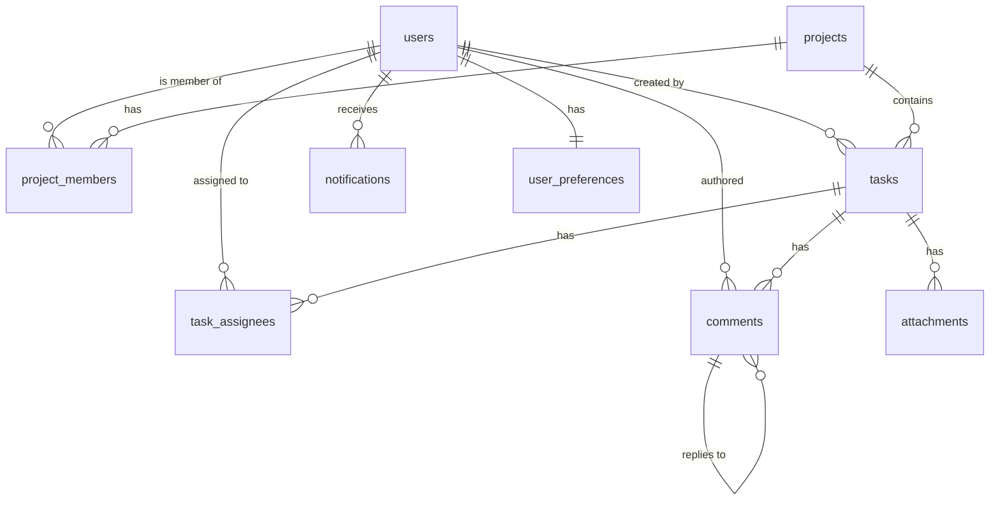

# TaskSphere Pro — PostgreSQL Schema Design

> Produced by Software Architect for ISSUE-0010. Implements ADR-0002.

## Schema overview

Each service owns its own PostgreSQL schema. All timestamps are `TIMESTAMPTZ`.

## Entity Relationship Diagram



---

## auth schema

### users

```sql
CREATE TABLE auth.users (
    id              UUID PRIMARY KEY DEFAULT gen_random_uuid(),
    email           VARCHAR(255) UNIQUE NOT NULL,
    name            VARCHAR(255) NOT NULL,
    password_hash   VARCHAR(255) NOT NULL,
    role            VARCHAR(20) NOT NULL DEFAULT 'member'
                    CHECK (role IN ('admin', 'project_manager', 'member', 'guest')),
    is_active       BOOLEAN NOT NULL DEFAULT true,
    created_at      TIMESTAMPTZ NOT NULL DEFAULT now(),
    updated_at      TIMESTAMPTZ NOT NULL DEFAULT now()
);

CREATE INDEX idx_users_email ON auth.users(email);
CREATE INDEX idx_users_role ON auth.users(role);
```

### refresh_tokens

```sql
CREATE TABLE auth.refresh_tokens (
    id              UUID PRIMARY KEY DEFAULT gen_random_uuid(),
    user_id         UUID NOT NULL REFERENCES auth.users(id) ON DELETE CASCADE,
    token_hash      VARCHAR(255) NOT NULL,
    expires_at      TIMESTAMPTZ NOT NULL,
    created_at      TIMESTAMPTZ NOT NULL DEFAULT now()
);

CREATE INDEX idx_refresh_tokens_user ON auth.refresh_tokens(user_id);
CREATE INDEX idx_refresh_tokens_expires ON auth.refresh_tokens(expires_at);
```

---

## projects schema

### projects

```sql
CREATE TABLE projects.projects (
    id              UUID PRIMARY KEY DEFAULT gen_random_uuid(),
    name            VARCHAR(255) NOT NULL,
    description     TEXT,
    is_private      BOOLEAN NOT NULL DEFAULT false,
    owner_id        UUID NOT NULL,
    created_at      TIMESTAMPTZ NOT NULL DEFAULT now(),
    updated_at      TIMESTAMPTZ NOT NULL DEFAULT now()
);

CREATE INDEX idx_projects_owner ON projects.projects(owner_id);
```

### project_members

```sql
CREATE TABLE projects.project_members (
    id              UUID PRIMARY KEY DEFAULT gen_random_uuid(),
    project_id      UUID NOT NULL REFERENCES projects.projects(id) ON DELETE CASCADE,
    user_id         UUID NOT NULL,
    role            VARCHAR(20) NOT NULL DEFAULT 'member'
                    CHECK (role IN ('project_manager', 'member', 'guest')),
    joined_at       TIMESTAMPTZ NOT NULL DEFAULT now(),
    UNIQUE(project_id, user_id)
);

CREATE INDEX idx_pm_project ON projects.project_members(project_id);
CREATE INDEX idx_pm_user ON projects.project_members(user_id);
```

---

## tasks schema

### tasks

```sql
CREATE TABLE tasks.tasks (
    id              UUID PRIMARY KEY DEFAULT gen_random_uuid(),
    project_id      UUID NOT NULL,
    title           VARCHAR(100) NOT NULL,
    description     TEXT,
    status          VARCHAR(20) NOT NULL DEFAULT 'backlog'
                    CHECK (status IN ('backlog', 'in_progress', 'review', 'done')),
    priority        VARCHAR(10) NOT NULL DEFAULT 'medium'
                    CHECK (priority IN ('low', 'medium', 'high', 'urgent')),
    created_by      UUID NOT NULL,
    created_at      TIMESTAMPTZ NOT NULL DEFAULT now(),
    updated_at      TIMESTAMPTZ NOT NULL DEFAULT now()
);

CREATE INDEX idx_tasks_project ON tasks.tasks(project_id);
CREATE INDEX idx_tasks_status ON tasks.tasks(status);
CREATE INDEX idx_tasks_priority ON tasks.tasks(priority);
CREATE INDEX idx_tasks_created_by ON tasks.tasks(created_by);
CREATE INDEX idx_tasks_search ON tasks.tasks USING GIN (
    to_tsvector('english', coalesce(title, '') || ' ' || coalesce(description, ''))
);
```

### task_assignees

```sql
CREATE TABLE tasks.task_assignees (
    id              UUID PRIMARY KEY DEFAULT gen_random_uuid(),
    task_id         UUID NOT NULL REFERENCES tasks.tasks(id) ON DELETE CASCADE,
    user_id         UUID NOT NULL,
    assigned_at     TIMESTAMPTZ NOT NULL DEFAULT now(),
    UNIQUE(task_id, user_id)
);

CREATE INDEX idx_ta_task ON tasks.task_assignees(task_id);
CREATE INDEX idx_ta_user ON tasks.task_assignees(user_id);
```

### comments

```sql
CREATE TABLE tasks.comments (
    id                  UUID PRIMARY KEY DEFAULT gen_random_uuid(),
    task_id             UUID NOT NULL REFERENCES tasks.tasks(id) ON DELETE CASCADE,
    author_id           UUID NOT NULL,
    parent_comment_id   UUID REFERENCES tasks.comments(id) ON DELETE CASCADE,
    body                TEXT NOT NULL,
    created_at          TIMESTAMPTZ NOT NULL DEFAULT now(),
    updated_at          TIMESTAMPTZ NOT NULL DEFAULT now()
);

CREATE INDEX idx_comments_task ON tasks.comments(task_id);
CREATE INDEX idx_comments_parent ON tasks.comments(parent_comment_id);
```

### attachments

```sql
CREATE TABLE tasks.attachments (
    id              UUID PRIMARY KEY DEFAULT gen_random_uuid(),
    task_id         UUID NOT NULL REFERENCES tasks.tasks(id) ON DELETE CASCADE,
    uploaded_by     UUID NOT NULL,
    filename        VARCHAR(255) NOT NULL,
    content_type    VARCHAR(50) NOT NULL
                    CHECK (content_type IN ('image/png', 'image/jpeg', 'application/pdf')),
    size_bytes      INTEGER NOT NULL CHECK (size_bytes <= 5242880),
    s3_key          VARCHAR(512) NOT NULL,
    created_at      TIMESTAMPTZ NOT NULL DEFAULT now()
);

CREATE INDEX idx_attachments_task ON tasks.attachments(task_id);
```

---

## notifications schema

### notifications

```sql
CREATE TABLE notifications.notifications (
    id              UUID PRIMARY KEY DEFAULT gen_random_uuid(),
    user_id         UUID NOT NULL,
    type            VARCHAR(50) NOT NULL,
    title           VARCHAR(255) NOT NULL,
    message         TEXT,
    link            VARCHAR(512),
    is_read         BOOLEAN NOT NULL DEFAULT false,
    created_at      TIMESTAMPTZ NOT NULL DEFAULT now()
);

CREATE INDEX idx_notifications_user ON notifications.notifications(user_id);
CREATE INDEX idx_notifications_unread ON notifications.notifications(user_id, is_read)
    WHERE is_read = false;
```

### user_preferences

```sql
CREATE TABLE notifications.user_preferences (
    user_id                 UUID PRIMARY KEY,
    email_notifications     BOOLEAN NOT NULL DEFAULT true,
    updated_at              TIMESTAMPTZ NOT NULL DEFAULT now()
);
```
